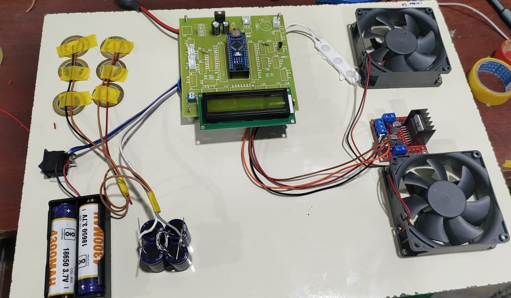
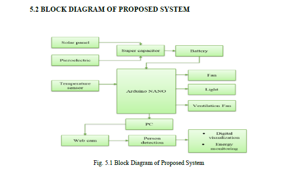
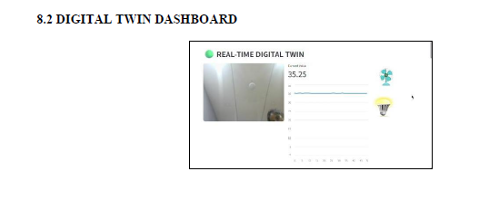

# 6G-Oriented Smart Home: Energy Harvesting + AI-Driven Automation

A smart home prototype built on Arduino Nano, combining solar and 
piezoelectric energy harvesting with AI-driven automation. The system 
uses digital twin technology to keep a real-time virtual model in sync 
with the physical setup, enabling remote monitoring and control.

## Overview

This project explores how future 6G-enabled smart homes could operate 
more sustainably by harvesting ambient energy (solar + piezoelectric) 
instead of relying purely on grid power, while using AI to automate 
decisions and a digital twin to monitor the system in real time.

## Hardware Prototype

The prototype includes an Arduino Nano, energy harvesting coils, 
18650 batteries, supercapacitors, an LCD display for live readings, 
and dual cooling fans controlled via a motor driver.

## System Architecture

The system harvests energy from solar panels and piezoelectric 
sensors, storing it in a supercapacitor and battery. The Arduino Nano 
processes temperature sensor data and controls the fan, light, and 
ventilation outputs. A webcam feeds into a PC for person detection, 
enabling digital visualization and energy monitoring.

## Digital Twin Dashboard

A real-time dashboard mirrors the physical system, showing live 
temperature readings and the current state of connected devices 
(fan, light), demonstrating the digital twin synchronization.

## Features

- Solar and piezoelectric energy harvesting for power supply
- AI-driven automation for smart decision-making
- Real-time digital twin synced with the physical prototype
- Person detection via webcam for energy-aware automation
- Energy-efficient automation demonstrated through live monitoring

## Tech Stack

- **Hardware:** Arduino Nano, solar panel, piezoelectric sensor, 
  supercapacitors, 18650 batteries, LCD display, motor driver, 
  cooling fans
- **Concepts:** IoT, energy harvesting, AI automation, digital twin, 
  person detection

## What I Learned

Working on this project gave me hands-on experience integrating 
embedded systems with renewable energy sources, and understanding 
how digital twin technology can be used for real-time monitoring 
and control in smart automation systems.

## Status

This was an academic project built as part of my B.E. in Electronics 
and Communication Engineering.

